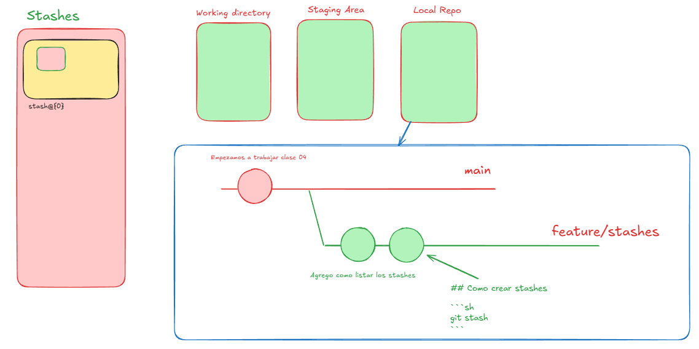

# Clase 04 - Git desarrollo colaborativo

## Stash 



* Existe dentro de git
* No se puede subir al remoto
* Trabaja con una estructura de pila

## Listar los stashes

```sh
git stash list
```

## Como crear stashes

```sh
git stash
git stash -m "Mensaje descriptivo"
```

## Recuperar el stash

```sh
git stash pop # Recupeara el último stash realizado y si no hay conflicto lo borra.
```

## Eliminar un stash en particular

```sh
git stash drop # Borra el stash de arriba de todo
git stash drop 1 # stash@{1}
git stash drop 2 # stash@{2}
```

## Ver contenido del stash

```sh
git stash show <identificador del stash>
git stash show 0
git stash show stash{0}
```

## Aplicar un stash en particular

```sh
git stash apply # Aplica el stash de arriba de todo
git stash apply 1 # stash@{1}
git stash apply 2 # stash@{1}
```

# RESETS

